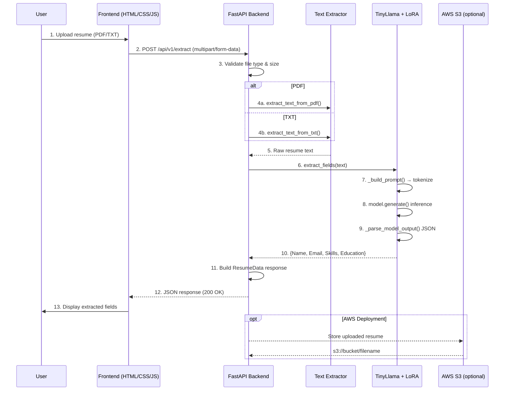

# Resume Information Extraction System

**Cloud Computing & Natural Language Understanding - Spring 2026**

Automated resume parsing system that extracts structured information (Name, Email, Skills, Education) from PDF and plain text resumes using a LoRA fine-tuned language model.

---

## Problem Statement

Manual resume processing is time-consuming and inefficient for recruiters and HR systems. This system automates information extraction, enabling organizations to process large volumes of resumes quickly and consistently.

**Target Users:** HR personnel, recruiters, organizations processing bulk resumes.

---

## Architecture

Modular design with three main layers:

| Layer | Technology |
|-------|------------|
| **Backend API** | FastAPI (Python 3.12) |
| **AI/ML** | TinyLlama-1.1B-Chat + LoRA (PEFT), PyTorch, HuggingFace Transformers |
| **Document Processing** | PyMuPDF (PDF parsing) |
| **Deployment** | Docker containerized for AWS EC2 |

---

## Data Flow



---

## Project Structure

```
resume-extractor-backend/
├── app/
│   ├── __init__.py
│   ├── main.py              # FastAPI app, routes, lifespan, tests
│   ├── models.py            # Pydantic response models
│   └── utils/
│       ├── __init__.py
│       ├── ai_extractor.py  # Model loading, inference, JSON parsing
│       ├── parser.py        # PDF and TXT text extraction
│       └── s3_helper.py     # AWS S3 upload (ready for deployment)
├── final-resume-model/      # LoRA adapter weights (2.2 MB)
│   ├── adapter_config.json
│   ├── adapter_model.safetensors
│   ├── chat_template.jinja
│   ├── tokenizer_config.json
│   └── tokenizer.json
├── notebooks/
│   └── ResumeExtraction.ipynb   # Model training notebook
├── main.py                      # Entry point (uvicorn runner)
├── requirements.txt             # Python dependencies
├── pyproject.toml               # Project metadata
├── Dockerfile                   # Docker containerization
├── .dockerignore
├── .gitignore
├── .python-version
└── README.md
```

---

## AI Model

### Base Model
- **Model:** `TinyLlama/TinyLlama-1.1B-Chat-v1.0`
- **Architecture:** Causal language model (1.1B parameters)

### Fine-tuning
- **Method:** LoRA (Low-Rank Adaptation) via PEFT library
- **Configuration:** rank=8, alpha=32, target modules=[q_proj, v_proj]
- **Training:** 3 epochs, max_length=512, batch_size=2
- **Dataset:** Kaggle Resume Entities for NER (220 labeled resumes)
- **Adapter Size:** 2.2 MB (`final-resume-model/adapter_model.safetensors`)

### Output Format
```json
{
  "Name": "John Doe",
  "Email Address": "john@example.com",
  "Skills": "Python, SQL, Machine Learning",
  "Education": "BS in Computer Science"
}
```

---

## Setup & Installation

### Prerequisites
- Python 3.12+
- GPU optional (CUDA for faster inference, CPU fallback supported)

### Install Dependencies

```bash
# Using pip
pip install -r requirements.txt

# Or using uv (recommended)
uv sync
```

### Model Setup

The fine-tuned LoRA adapter is already included in `final-resume-model/`. No additional download required.

### Environment Variables

| Variable | Default | Description |
|----------|---------|-------------|
| `MAX_UPLOAD_SIZE_MB` | `10` | Maximum file upload size in MB |
| `RESUME_MODEL_PATH` | `./final-resume-model` | Path to LoRA adapter directory |
| `AWS_ACCESS_KEY_ID` | - | AWS credentials (for S3 deployment) |
| `AWS_SECRET_ACCESS_KEY` | - | AWS credentials (for S3 deployment) |
| `AWS_REGION` | `us-east-1` | AWS region |
| `S3_BUCKET_NAME` | - | S3 bucket for resume storage |

---

## Running the Server

### Development Mode

```bash
python main.py
# or
uvicorn app.main:app --host 0.0.0.0 --port 8000 --reload
```

### Production (Docker)

```bash
# Build
docker build -t resume-extractor -f Dockerfile .

# Run
docker run -p 8000:8000 resume-extractor
```

The API will be available at `http://localhost:8000`

---

## API Reference

### Health Check

```http
GET /
```

**Response:**
```json
{"status": "API is running"}
```

---

### Extract Resume Data

```http
POST /api/v1/extract
Content-Type: multipart/form-data
```

**Request:**
- `file` (required): PDF or TXT file upload

**Success Response (200 OK):**
```json
{
  "status": "success",
  "message": "Successfully extracted data from resume.pdf",
  "data": {
    "name": "John Doe",
    "email": "john@example.com",
    "skills": ["Python", "SQL", "Machine Learning"],
    "education": ["BS in Computer Science"]
  }
}
```

**Error Responses:**

| Status | Description |
|--------|-------------|
| 400 | Invalid file type or content type |
| 413 | File exceeds maximum size (10 MB) |
| 422 | PDF/text parsing error (empty or unreadable) |
| 503 | Model not loaded or inference failure |
| 500 | Internal server error |

### Example (cURL)

```bash
# PDF upload
curl -X POST http://localhost:8000/api/v1/extract \
  -F "file=@resume.pdf"

# Plain text upload
curl -X POST http://localhost:8000/api/v1/extract \
  -F "file=@resume.txt"
```

---

## Testing

### Unit Tests (Parser)

```bash
python -m app.utils.ai_extractor --test
```

Tests `_parse_model_output()` with:
- Valid JSON
- JSON with null values
- Code-fenced JSON (```json ... ```)
- JSON embedded in text
- Malformed output (fallback)
- Output with `### Response:` prefix

### API Integration Tests

```bash
python -m app.main --test
```

Tests:
- Health check endpoint
- Unsupported file extension rejection
- Invalid content type rejection
- Plain text file acceptance
- Oversized file rejection
- Valid PDF processing

---

## Cloud Deployment (AWS)

### Architecture
- **Compute:** Amazon EC2 (GPU instance recommended)
- **Storage:** AWS S3 (resume file persistence)
- **Monitoring:** AWS CloudWatch (logs and metrics)

### Deployment Steps

1. Build Docker image locally
2. Push to ECR or Docker Hub
3. Launch EC2 instance with GPU support
4. Pull and run Docker container
5. Configure S3 bucket and IAM credentials
6. Enable CloudWatch logging

### S3 Integration

S3 upload code is implemented in `app/utils/s3_helper.py` but commented out in the API route for local development. Uncomment line 90 in `app/main.py` when deploying to AWS.

---

## Team (Section 11)

| Role | Member | ID |
|------|--------|-----|
| Backend | Ahmed Tamer | 20230009 |
| Frontend | Mohamed Nader | 20230509 |
| AI/ML | Sameer Ahmed | 20230265 |
| Storage | Ibrahim Ahmed | 20230003 |
| Database | Mohamed Wajeh | 20230514 |
| Containerization & Cloud | Kerellos Emad | 20230424 |

---

## Dataset & Training

### Dataset
- **Source:** Kaggle - dataturks/resume-entities-for-ner
- **Size:** 220 labeled resumes
- **Fields:** Name, Email Address, Skills, Education, Experience

### Training Notebook
See `notebooks/ResumeExtraction.ipynb` for complete training workflow:
1. Dataset loading and preprocessing
2. Model loading with 4-bit quantization (BitsAndBytes)
3. LoRA configuration and SFTTrainer setup
4. Training loop (3 epochs)
5. Model evaluation (F1-score)
6. Adapter export to `final-resume-model/`

---

## Evaluation Plan (Section 9)

| Metric | Method |
|--------|--------|
| **Extraction Accuracy** | Precision, Recall, F1-score per field |
| **Model Comparison** | Base TinyLlama vs LoRA fine-tuned |
| **Inference Latency** | Time from upload to JSON response |
| **API Reliability** | Success rate, error handling |
| **Monitoring** | CloudWatch logs and metrics |

Evaluation code is in `notebooks/ResumeExtraction.ipynb` (Cell 5).

---

## Scope & Limitations

### MVP (Implemented)
- Upload PDF or plain text resume
- Extract 4 fields: Name, Email, Skills, Education
- Return structured JSON response
- Docker containerization ready

### Not Yet Implemented (Stretch Goals)
- Experience field extraction
- Batch upload support
- Confidence scores per extracted field
- Arabic resume support
- Frontend UI (separate repository)
- Database persistence (MongoDB/DynamoDB)

### Constraints
- Maximum file size: 10 MB (configurable)
- Input truncation: 1024 tokens (longer resumes may lose content)
- PDF only: Scanned/image-based PDFs not supported (requires OCR)

---

## Ethics & Privacy

- Uses only publicly available datasets (Kaggle)
- No PII stored or logged
- Files processed in-memory, deleted after response
- S3 storage optional and configurable

---

## License

Academic project for Cloud Computing & NLU courses - Spring 2026.
